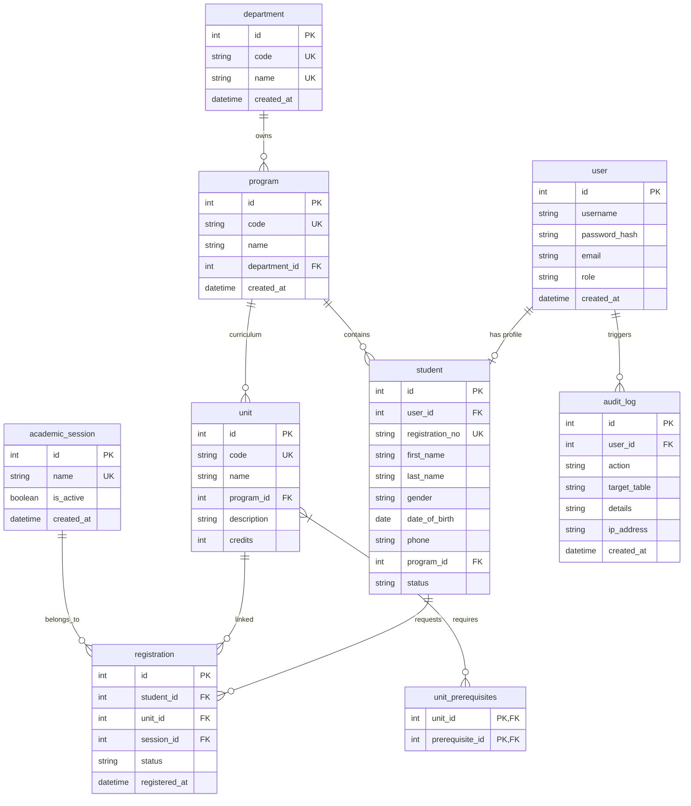
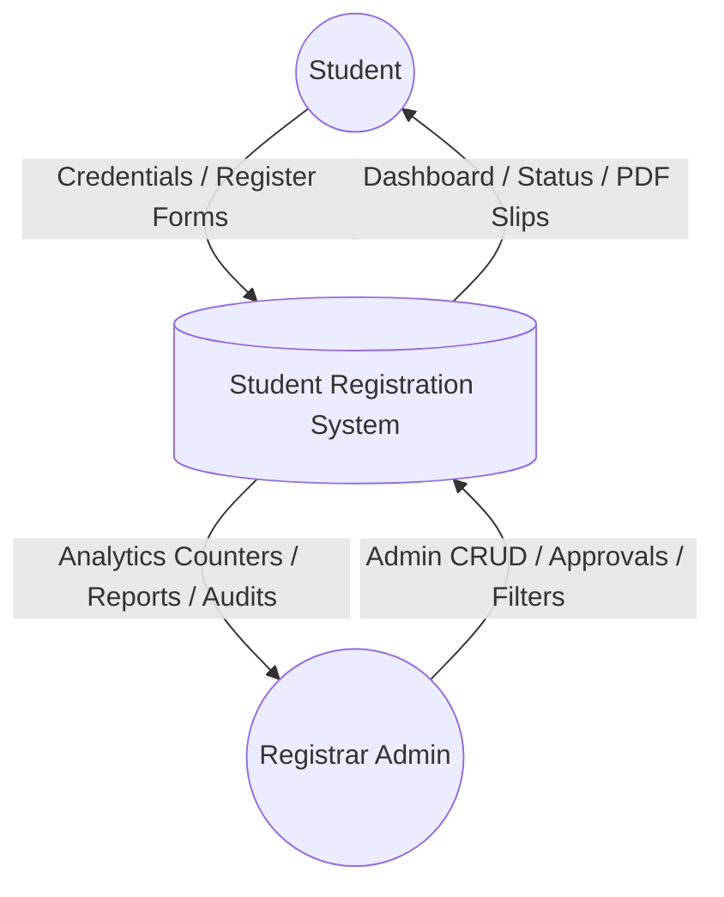
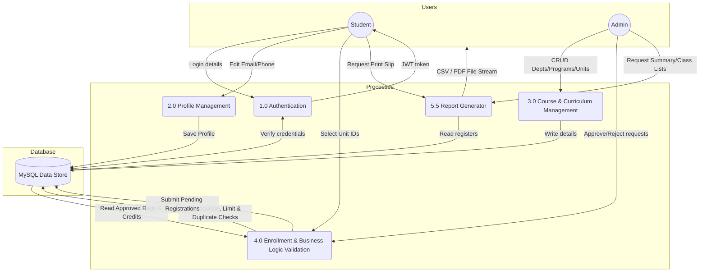
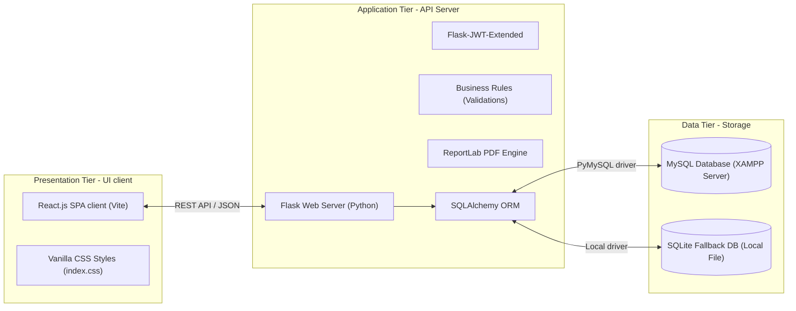
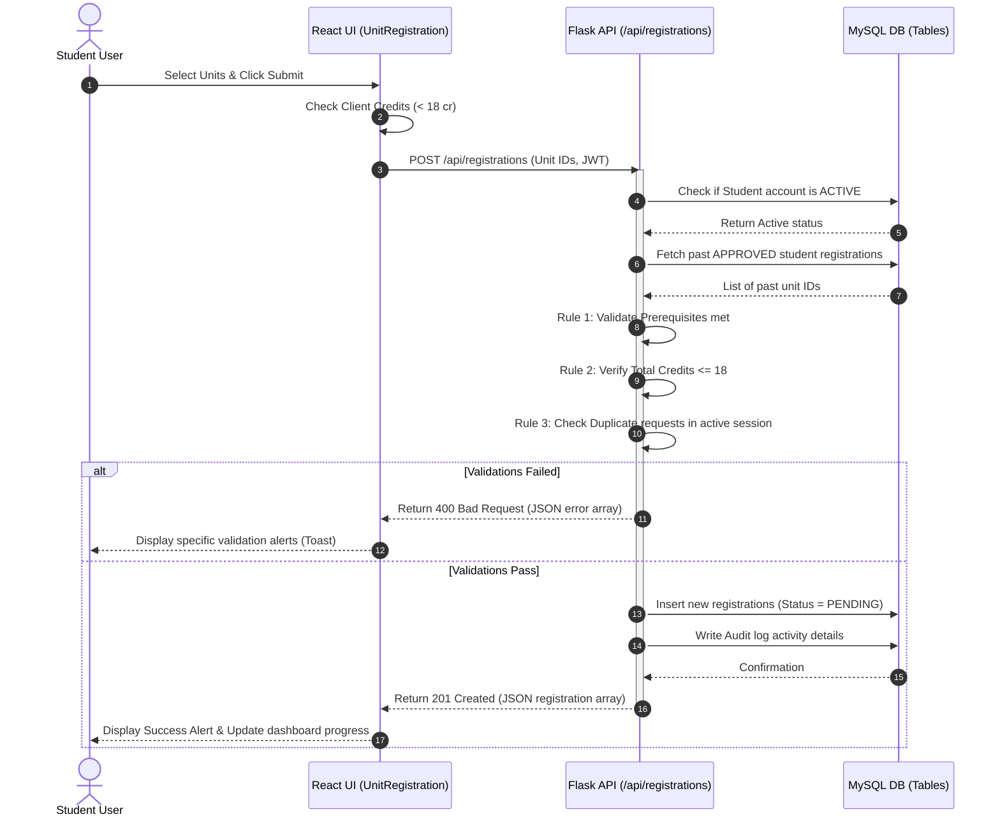

# System Architecture and Design Diagrams

This document contains visual diagrams for the Student Registration System, representing database schemas, data flows, client-server tiers, and sequence steps.

---

## 1. Use Case Diagram
Describes user roles (Students and Registrar Administrators) and their respective actions.

```mermaid
usecaseDiagram
    actor Student
    actor Admin as "Registrar Admin"

    rect "Student Registration System"
        Student --> (Login / Logout)
        Student --> (Self-Service Registration)
        Student --> (Manage Profile)
        Student --> (Register for Units)
        Student --> (View Registration Status)
        Student --> (Download/Print Slip)

        (Register for Units) ..> (Prerequisite Check) : include
        (Register for Units) ..> (Credit Limit Check) : include

        (Login / Logout) <-- Admin
        Admin --> (Manage Students CRUD)
        Admin --> (Manage Depts & Programs CRUD)
        Admin --> (Manage Units CRUD)
        Admin --> (Approve / Reject Registrations)
        Admin --> (Generate CSV/PDF Reports)
        Admin --> (View Security Audit Logs)
    end
```

---

## 2. Entity Relationship Diagram (ERD)
Illustrates the MySQL relational database schema, tables, keys, and cardinality.



---

## 3. Data Flow Diagrams (DFD)

### Level 0: Context Diagram
Maps system inputs and outputs from entities.



### Level 1: Process Decomposition
Breaks down logical subprocesses and storage databases.



---

## 4. System Architecture Diagram (Three-Tier Tiers)
Shows physical separation of components.



---

## 5. Sequence Diagram: Course Registration Workflow
Steps triggered when a student submits their unit selections.


